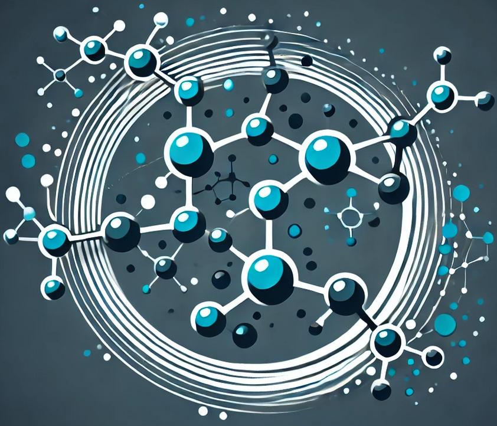

# GFlowNet-Molecule-Generator



## Overview

**GFlowNet-Molecule-Generator** is a Python-based implementation of a **Generative Flow Network (GFlowNet)** for generating small molecular structures. This repository demonstrates how GFlowNets can be applied to generate diverse molecules, a critical task in **drug discovery** and **material design**.

In this project, we use GFlowNets to generate molecules by incrementally adding atoms, aiming to sample molecules with probabilities proportional to a reward function, which evaluates their "drug-likeness." This example serves as a foundation for understanding GFlowNets and how they can be applied to real-world challenges in generative modeling.

---

## Features

- **Generative Modeling**: Uses a GFlowNet to generate molecules atom by atom.
- **Reward-Based Sampling**: Samples molecules based on drug-likeness (QED) as a reward.
- **Diversity Promotion**: Generates a variety of molecules with desirable properties.
- **Python and PyTorch**: Implemented using PyTorch with RDKit for molecule handling.

---

## Getting Started

### Prerequisites

Make sure you have Python 3 installed. The primary libraries required are **PyTorch** and **RDKit**.

### Installation

1. Clone the repository:

   ```bash
   git clone https://github.com/yourusername/GFlowNet-Molecule-Generator.git
   cd GFlowNet-Molecule-Generator
   ```

2. Install dependencies:

   ```bash
   pip install torch rdkit-pypi
   ```

---

## Usage

1. Run the training script:

   ```bash
   python main.py
   ```

   This script trains the GFlowNet model to generate molecules with high QED scores, a metric for drug-likeness.

2. Sample molecules:

   After training, the model samples diverse molecules with properties based on the reward function.

3. Visualize generated molecules:

   The script includes a function to display sampled molecules in a grid, providing a quick view of the diversity and structure of generated molecules.

---

## Methodology

### Key Concepts

- **States**: Represent the partial or complete molecular structures.
- **Actions**: Include adding an atom (from a predefined set) or terminating the generation.
- **Reward Function**: We use the QED (Quantitative Estimate of Drug-likeness) score, which evaluates molecules based on various "drug-like" properties.
- **Policy Network**: A neural network that outputs action probabilities given a molecule’s current state.

### Training Process

1. **Initialize**: Start with an empty molecule.
2. **Sample Trajectory**: Add atoms sequentially according to the policy network.
3. **Compute Reward**: Once a complete molecule is generated, compute its reward based on the QED score.
4. **Backpropagate**: Update the policy network to increase the probability of sampling high-reward molecules.
5. **Repeat**: Train over multiple iterations to refine the policy.

### Example Output

After training, the model generates molecules like these (visualized using RDKit):


---

## Repository Structure

- `main.py`: Main script for training and sampling molecules.
- `requirements.txt`: Lists the required dependencies for the project.

---

## Future Improvements

To expand this project, consider:

- Adding bond formation actions for more realistic molecule structures.
- Using a **Graph Neural Network** for more advanced state representation.
- Extending the reward function to incorporate other molecular properties like toxicity or solubility.

---

## License

This project is licensed under the MIT License - see the [LICENSE](LICENSE) file for details.

---

## Contributing

Contributions are welcome! Feel free to open an issue or submit a pull request to suggest improvements or new features.
